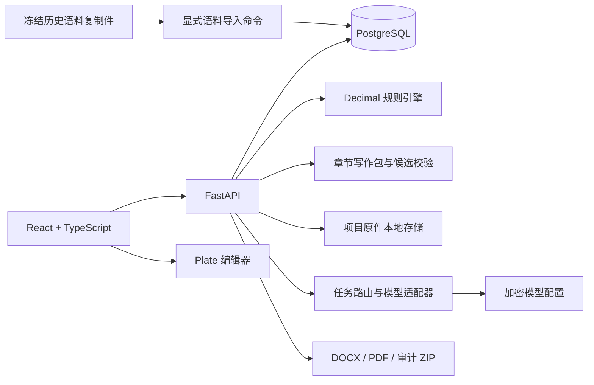
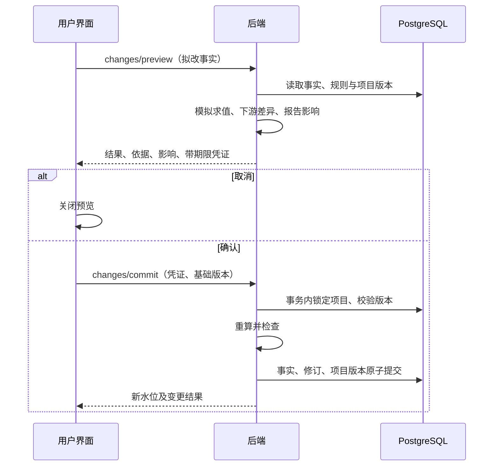

# 通用专业报告平台详细设计文档

版本：2.2

核查日期：2026-09-26

性质：当前实现说明与后续设计基线

关联：[产品需求文档](产品需求文档.md) · [开发清单](开发清单.md) · [README](../README.md)

## 1. 文档口径

本文件以当前代码、数据模型和验收记录为依据。标为“已实现”的内容可以在当前应用中找到实现；标为“部分实现”的内容有可用路径，但尚未满足全部产品目标；标为“待开发”的内容不能视为现有能力。根目录早期技术设计提出的组织权限、领域包、异步任务、对象存储、完整语义 Diff、Outbox 等属于目标架构，不代表当前代码已经具备。

当前版本适合本机试点和受控演示。普通项目的核心路径为：项目文件 → 待审候选 → 项目事实 → 确定性规则 → 章节候选 → Plate 工作稿 → 人工核对 → DOCX/PDF/审计包。历史澄岳精密语料作为单独项目中的只读资产；该项目现在可另存自己的模型专题工作稿，语料记录本身仍不可编辑。新项目经明确选择后只读引用历史结构和模式。

### 1.1 当前能力边界

| 范围 | 当前实现 | 后续边界 |
| --- | --- | --- |
| 30 类历史资料 | 30 类、114 个产物文件、3 个辅助文件已入库并可分类浏览 | 不等于从任意新报告自动抽取 30 类，也不等于每类都实际参与写作 |
| 章节写作包 | 按章节组装数据库记录；49 个历史章节可查来源 | 仅 S4、S7.1、S5.2 有受限引导起草；其他章节尚无已验证成稿规则 |
| 逐类应用 | 每项目每章节持久保存 30 类的 `auto/review/exclude`，逐类作用可查看；1–6 类可只读模拟移除 | 模拟仅对 S4、S7.1、S5.2 已适配；“受阻”可能只是当前构造器依赖，不能证明类别不可替代 |
| 规则 | Decimal、受限 AST、依赖校验、预览和事务提交 | 没有独立规则版本发布机制，没有自动单位换算 |
| Plate | 当前菜单节点、事实引用、来源、版本和导出已连通 | 不含 Plate 演示站的全部插件；不是完整语义 Diff |
| 模型 | 抽取/OCR 路由及 S4/S7.1 受控写作包起草已接入；两章分别完成真实模型候选取消、再次预览确认，留下2个审计事件和预审导出核对 | 限于两章白名单投影；不发送历史原句或全部证据；尚不能自动审定跨类型专业结论，缺本项目原件时正式导出仍阻断 |
| 历史文章整理 | 澄岳项目选 S4/S5.2/S7.1，只读取入库目录与原文切块，模型逐段附来源；确认后保存项目文章并进入 Plate | 本次只消费 CAT-04/09；仅作为待核对的历史专题工作稿，不开放正式报告发布 |
| 核对与导出 | 当前正文、事实快照、原件位置和引用闸门；预审/正式分开 | 不是独立专业审批，不构成证据真实性认证 |
| 部署 | 本机 React/Vite + FastAPI + PostgreSQL | 团队私有化生产部署尚缺认证、权限、完整迁移、任务系统与托管密钥 |

## 2. 当前架构



这是模块化单体。没有独立 Worker、Redis、向量库、图数据库、Semantica 或对象存储运行依赖。图谱由 PostgreSQL 中的节点/边投影提供给前端 React Flow；模型请求由后端发出。上传文档二进制保存在服务端文件目录，历史语料二进制保存在 PostgreSQL；两者不能混为“所有文件都存文件系统”或“所有上传原件都入库”。

### 2.1 技术与职责

| 层 | 当前技术 | 职责 |
| --- | --- | --- |
| 前端 | React 19、TypeScript、Vite 6 | 项目切换、表单、抽屉、工作包和编辑流程 |
| 编辑器 | Plate 53、basic-nodes/list/table/link/slash-command | 当前支持的正文节点及交互 |
| 图谱 | `@xyflow/react`、Dagre | 局部关系图、布局、详情与筛选 |
| API | Python 3.12+、FastAPI、Pydantic | 请求约束、项目边界、事务编排 |
| 持久化 | PostgreSQL 16、SQLAlchemy 2、psycopg | 事实、修订、报告、语料与图索引 |
| 文档 | PyMuPDF、python-docx、ReportLab | PDF/DOCX 定位、表格行、导出 |
| 模型 | httpx、OpenAI 兼容协议及 MinerU 适配 | 按任务调用，解析结构化候选 |
| 密钥 | Fernet、服务端配置文件 | API Key 加密与掩码返回 |
| 验证 | pytest、Playwright、TypeScript/Vite build | 规则/API/AST/数据测试及浏览器交互 |

前端精度显示可以使用 `decimal.js`，权威计算始终在后端。模型不具有直接改事实、确认报告或越过导出闸门的权限。

### 2.2 代码地图

| 文件 | 主要职责 |
| --- | --- |
| [backend/app/main.py](../backend/app/main.py) | API、项目边界、预览凭证、事实/报告事务、核对与导出编排 |
| [backend/app/db.py](../backend/app/db.py) | 业务表、数据库连接、当前增量建表逻辑 |
| [backend/app/rules.py](../backend/app/rules.py) | 白名单 AST、Decimal、单位、DAG |
| [backend/app/corpus_import.py](../backend/app/corpus_import.py) | 冻结复制件核验、资产/记录/图谱导入 |
| [backend/app/corpus_storage.py](../backend/app/corpus_storage.py) | 历史语料表 |
| [backend/app/corpus.py](../backend/app/corpus.py) | 数据库语料读取、类别视图、来源定位、局部图 |
| [backend/app/document_pipeline.py](../backend/app/document_pipeline.py) | DOCX/PDF 分段、表格候选、词面来源检查、模型候选 |
| [backend/app/model_settings.py](../backend/app/model_settings.py) | 模型 CRUD、任务路由、连接测试、OCR 适配与密钥管理 |
| [backend/app/writing.py](../backend/app/writing.py) | C0052/C0083 槽位、条件与格式适配 |
| [backend/app/writing_support.py](../backend/app/writing_support.py) | 章节包、可复用条目、拒用原因、三章候选与来源 |
| [backend/app/writing_materials.py](../backend/app/writing_materials.py) | 本章 30 类应用配置、持久版本、纯内存移除模拟 |
| [backend/app/writing_model.py](../backend/app/writing_model.py) | 模型输入白名单投影、摘要、输出事实/材料引用校验 |
| [backend/app/report_pipeline.py](../backend/app/report_pipeline.py) | Plate AST 校验、正文差异、数字闸门、DOCX/PDF/ZIP |
| [frontend/src/App.tsx](../frontend/src/App.tsx) | 壳层、项目切换、可用菜单和位置恢复 |
| [frontend/src/ProjectView.tsx](../frontend/src/ProjectView.tsx) | 事实、规则、修订、影响预览 |
| [frontend/src/DocumentsView.tsx](../frontend/src/DocumentsView.tsx) | 文档页、抽取与候选核对 |
| [frontend/src/CorpusView.tsx](../frontend/src/CorpusView.tsx) | 七组 30 类内容化视图和文件作用入口 |
| [frontend/src/GraphPanel.tsx](../frontend/src/GraphPanel.tsx) | 搜索、筛选、局部展开、路径高亮 |
| [frontend/src/CorpusWritingPanel.tsx](../frontend/src/CorpusWritingPanel.tsx) | 参考选择、章节包、事实映射、候选确认 |
| [frontend/src/MaterialApplicationPanel.tsx](../frontend/src/MaterialApplicationPanel.tsx) | 七组类别作用、使用方式、示例/项目事实模拟 |
| [frontend/src/ReportsView.tsx](../frontend/src/ReportsView.tsx) | Plate、来源抽屉、保存、版本、核对导出 |
| [frontend/src/ModelSettingsView.tsx](../frontend/src/ModelSettingsView.tsx) | 模型配置、任务绑定与连接状态 |

## 3. 数据权威与隔离

### 3.1 三种数据域

1. **历史语料**：冻结的虚构项目资料。原件、历史数字、供应商、历史论断和审核结论保留原貌，只读展示。
2. **项目事实**：本项目录入、经确认的文档候选或确定性规则计算结果。新项目初始为空。
3. **报告版本**：Plate AST、绑定事实快照及语料来源。报告正文不是项目事实的隐式更新入口。

所有项目业务请求从路径中的 `project_id` 进入。文档、报告、候选、事实及证据绑定均检查项目归属。历史项目的事实、规则、原件及冻结语料写接口继续拒绝修改；仅允许经模型候选确认创建该项目自己的文章报告，以及用预览凭证保存其 Plate 修订。`project_corpora` 表将只读语料绑定到历史项目；普通项目不因此获得任意历史项目读权。

`writing_references` 是另一条明确的只读引用边界：用户选定当前支持的语料 ID、版本、目标报告类型并确认后，章节接口才允许读取相关来源。当前仅接受内置澄岳语料与可研/建设类目标；事故调查等类型返回不适用。已有基于旧参考的正文时，不能直接切换参考版本。

历史项目的文章整理不复制历史事实到 `project_facts`。`corpus_article.source_pack` 用章节目录（CAT-04）的 chunk ID，从同一语料版本的 CAT-09 精确读取原文，当前仅开放 S4、S5.2、S7.1。模型输入只含文章标题、章节名、语料版本及该章切块正文。模型返回 2–6 段，每段必须列 1–4 个存在的切块 ID；来源外数字拒绝。若表号标题与表格分属两个切块，服务端仅在精确匹配表号时补充标题切块；S5.2 必须同时写出 800/650 与未解决分歧。此类检查是可核对性门槛，不是语义真实性认证。

预览返回带 10 分钟时限的 HMAC 候选，取消不写报告。确认事务复查项目归属、语料版本、输入摘要、逐段来源和签名，创建 `report_drafts` v0、`report_versions` v0 与 `writing_commit_events` 的模型调用及来源摘要。后续 Plate 编辑使用现有预览/保存/版本接口；`source_refs` 按本项目绑定的冻结语料校验，段落来源变更仍受事件核对。历史文章不具备项目事实与完整原件的正式报告闸门，UI 仅展示工作稿编辑，不提供正式核对/发布。

**限制**：目前没有登录、操作者身份或项目 ACL。上述隔离是应用数据范围检查，不是多用户访问控制。数据库中部分 `fact_key`/record 引用由服务层验证，没有全部建成复合外键。不要将此版本直接开放给不可信网络访问。

### 3.2 业务表

字段为关键字段摘要，准确列定义以 [db.py](../backend/app/db.py) 为准。

| 表 | 主键/唯一约束 | 关键字段与用途 |
| --- | --- | --- |
| `projects` | UUID `id` | `name`、事实水位 `version`、创建/更新时间 |
| `project_facts` | UUID；`(project_id,key)` 唯一 | `data_type`、`value_text`、`value_status`、单位、口径、时点、来源、`revision` |
| `rules` | UUID；`(project_id,target_key)` 唯一 | 名称、目标、表达式、依赖 `deps`；同一事实一个计算规则 |
| `fact_revisions` | UUID | 项目、事实 key、`project_version`、before/after JSON、原因、时间 |
| `source_documents` | UUID | 项目、文件名/类型、SHA256、`storage_name`、页数、segments JSON、状态 |
| `extraction_candidates` | UUID | 原件、抽取运行、候选值/类型/单位、`source_ref`、`source_valid`、审核状态、确认后的事实 key |
| `extraction_runs` | UUID | 项目/原件/页码、状态、模型调用元数据、输入位置/摘要、候选数量、脱敏错误 |
| `fact_evidence_bindings` | UUID；`(project_id,fact_key,fact_revision)` 唯一 | 当前事实修订与本项目原件、片段列表、值的核对绑定 |
| `report_drafts` | UUID | 项目、标题、当前版本、AST `content`、`bound_facts`、`reviewed_hash` |
| `report_versions` | `(report_id,version)` | 已保存 AST、事实快照、核对摘要、创建时间 |
| `project_corpora` | `project_id`；`corpus_id` 唯一 | 内置语料归属的只读项目 |
| `writing_bindings` | `(project_id,slot_id)` | 历史槽位到本项目 `fact_key` 的人工映射，不存历史值 |
| `writing_references` | `project_id` | 固定语料/版本、目标报告类型、确认时间 |
| `writing_material_settings` | `(project_id,section_id)` | 配置修订 `revision`、类别使用方式 JSON、更新时间；默认 `auto` |
| `writing_commit_events` | UUID | 确认写入的报告/版本/章节、语料版本、模式、块 ID、来源、问题、已确认条目；模型模式另存 `model_audit` |

事实数值在数据库中以规范化十进制字符串保存，计算时转为 `Decimal`；没有使用二进制浮点作为计算权威值。不能把 `value_text` 字符串存储误写成当前数据库有 `NUMERIC` 类型事实值列。

报告版本的**正文内容**作为保存快照保留；人工核对会更新当前版本对应行的 `bound_facts` 与 `reviewed_hash`。因此它还不是包含所有核对/交付事件的完全不可变发布快照。完整事件化审计属于后续工作。

### 3.3 语料表

| 表 | 身份 | 内容 |
| --- | --- | --- |
| `corpus_archives` | `corpus_id` | 版本、manifest、完整性、文件/类别计数、导入时间 |
| `corpus_categories` | `(corpus_id,number)` | 类别 payload/context、记录计数 |
| `corpus_artifacts` | `(corpus_id,path)`；语料内 `artifact_id` 唯一 | 原始二进制、SHA256、字节数、媒体类型、解析副本、作用/用途/边界/说明来源 |
| `corpus_records` | `(corpus_id,category_number,record_id)` | 顺序、语义 ID、asset 关联、来源位置、JSONB payload |
| `corpus_graph_nodes` | `(corpus_id,id)` | 名称、对象类型、来源路径 |
| `corpus_graph_edges` | `(corpus_id,id)` | source、target、类型、origin、derivation |
| `corpus_source_assets` | `(corpus_id,name)` | 说明表等导入依据的原件二进制、摘要、用途 |

`record_id` 标识一个类别中的具体记录，`semantic_id` 是 N017、R006、L002 等历史业务编号。正文来源必须同时携带语料与类别身份，不能凭 `N017` 在所有项目中定位。

当前 `corpus_archives.id` 为主键，`version` 是其属性；并未用 `(corpus_id,version)` 复合主键支持一个语料多版并存。引用会校验版本一致，后续做多版本发布时必须迁移数据模型，不能直接覆盖已被报告引用的历史版本。

## 4. 30 类入库、展示与图谱

### 4.1 显式导入

导入入口：[import_builtin_corpus.py](../backend/scripts/import_builtin_corpus.py)。流程：

1. 读取项目内冻结复制件的 manifest 与文件说明表。
2. 核对分类、实体文件与 SHA256SUMS；117 个实体中有 116 条摘要，校验和文件不校验自身。
3. 解析成类别、原始资产、结构化记录、节点及边；按资产摘要和稳定身份关联。
4. 在数据库事务中写入语料专用表。重复导入保持幂等；`--rebuild` 用于显式重建投影。
5. 正常运行的类别、详情、原文与图谱查询读取 PostgreSQL，不读取 Downloads 或语料复制目录。

包内说明与脚本均作为语料数据保留，应用不执行 `validate_package.py`。重建入库不等于重新从原文抽取，也不会把历史数字填入普通项目事实表。

最新入库核验记录：30 类、117 资产、3,462 条结构化记录、728 图对象、1,666 条原始关系和 566 条由明确字段派生的关系。这些是一个特定语料版本的观测值，应由导入校验重新计算，不作为任意语料的硬编码计数。

### 4.2 类别预览契约

| 分组 | 类别 | 主视图 |
| --- | --- | --- |
| 基础信息 | 01 manifest、02 meta、03 provenance | 目录/状态摘要、信息卡、过程时间线 |
| 原始资料与结构 | 04 outline、05 原始 DOCX、06 normalized、07 offset_map、08 assets | 章节树、正文/表格原件预览、排版正文、位置对照、18 表目录 |
| 内容切块 | 09 chunks、10 skeletons、11 embeddings | 分页原文、原文/槽位对照、Parquet schema 与零行状态 |
| 语义图谱 | 12 nodes、13 rules、14 relations、15 claims、16 invariants、17 graph | 节点台账、依赖图、关系图/表、论断支撑、校验定义、局部探索 |
| 证据与推演 | 18 evidence、19 excerpts、20 derivation、21 decisions、22 trace | 证据目录、摘录正文、推演步骤、取舍卡、轨迹过滤 |
| 质量审查 | 23 conflicts、24 gaps、25 gate_report | 双来源冲突、缺口清单、历史闸门分组 |
| 写作与索引 | 26 style、27 section_templates、28 node_index、29 term_index、30 signature | 格式规范、49 章树、出现位置反查、术语别名、结构特征卡 |

每类保留内容化主视图、定位/筛选、详情及原始数据入口；原文件作为审计来源存在，不能成为工作台唯一展示方式。文件“作用说明”从 `corpus_artifacts` 的说明字段读取。

### 4.3 图谱

服务端按焦点、1–2 跳深度、对象类型、关系类型和方向过滤，前端支持搜索、选择、路径高亮、缩放与适配。图与列表均显示方向、关系名、来源及原始/派生标记。派生边只来自数据中明确字段，不作模型补边或隐含关系推断。

已核对路径包括 `N013 → R001 → N017 → L002 ← EV-01`；X001 保留 N050/N051 与 EV-06A/EV-06B 的两个来源。默认使用局部图，避免把全部原始边同时铺开。

原始 graph、node_index 等仍作为历史资产保存，运行时索引只是可重建投影。图谱浏览成功只证明记录和关联可查，不能证明每种关系对新报告成稿都有增益。

## 5. 项目事实与规则引擎

### 5.1 值状态

| 状态 | 语义 | 计算参与 |
| --- | --- | --- |
| `UNDEFINED` | 定义存在，尚未提供值 | 缺失依赖 |
| `PROVIDED` | 经录入/候选确认的值，包含有效 `0` | 可以参与 |
| `COMPUTED` | 本项目受限规则所得结果 | 可以参与 |
| `UNEVALUABLE` | 必要输入缺失，无法求值 | 继续向下游传播不可评估 |

当前没有独立的事实 review_status、usage_status 三轴状态系统。事实证据是否核对由当前修订的 `fact_evidence_bindings` 判断，不能从 `PROVIDED` 推断已经验证原件。

### 5.2 表达式

`ast.parse(..., mode='eval')` 后遍历白名单，再由自定义解释器计算；不调用 Python `eval`。支持 `+ - * /`、一元正负、比较、`min/max/floor/ceil`、项目事实 key 和数字常量。属性、下标、任意函数、导入和脚本语法均拒绝。每条规则至少引用一个项目事实。

Decimal 精度为 50。依赖由 AST 提取，检查未知引用、目标冲突和循环后按拓扑顺序计算。除零、非法表达式或不匹配单位返回错误，整次提交不落半套结果。

单位检查同时考虑量纲和直接单位标记。乘除传播量纲，加减/比较要求兼容；无量纲零可用于 `max(金额差,0)`。不自动转换元/万元或百分比比例，规则作者必须明示换算。当前不是通用物理单位库。

验收例：`min(first_year_demand, qualified_capacity)` 在输入 `300000` 和 `254016` 套时得到 `254016` 套；需求为 `0` 得到 `0`；需求未定义时结果为 `UNEVALUABLE`。

### 5.3 预览与提交



预览不修改事实或报告。确认检查 HMAC、有效期和基础版本；过期、内容被改动、项目版本变化均要求重新预览。凭证签名密钥当前在服务进程内，重启会使未提交预览失效；尚不支持多实例共用预览签名与持久化幂等键。

规则表当前没有独立 `version` 列。写作段落通过 `rule_id + expression + deps + input_fact_revisions + target_fact_revision` 保存计算快照，能检测规则或输入变化，但不能声称已经实现完整规则版本库。

## 6. 文件解析、OCR 与候选确认

### 6.1 原件与位置

上传 PDF/DOCX 后计算 SHA256、保存原件并产生 `segments`。PDF 保留页码、块/行位置与可用坐标；DOCX 保留段落和表格行定位。可读 PDF 的表格抽取补充行级片段，避免全部表格数字挤在整页文字里。复杂 Word 版式以原件为准。

扫描页识别经 OCR 任务路由选择 MinerU 或视觉协议。OCR 文字作为待核对来源片段保存，不会直接写事实。失败时显示错误并保留原件状态；当前整页 OCR 的回链粒度仍较粗。

### 6.2 抽取与审核

单页抽取组合明确表格数值候选与模型原子候选。候选先写 `extraction_candidates`，`review_status=PENDING`；来源来自该原件该页实际片段。每次抽取保存 `extraction_runs` 的模型元数据、输入位置和摘要、状态与数量，不保存 API Key。

审核人确认字段名、类型、值、单位及主来源；可补充最多两处同页片段。主片段必须直接支持该值，服务端再检查项目归属和词面支持。确认在事务内创建项目事实与修订；拒绝只变更候选状态。

`source_valid` 是数字/文字匹配检查，不能证明主体、口径、时点、单位或因果判断正确。候选值匹配原文不是独立金标验收。前端多页流程顺序调用单页接口，每次最多 8 页、单页文本有长度上限；尚无断点续跑的后台任务系统。

### 6.3 当前原件绑定

事实可以通过 `/facts/{key}/evidence/bind` 绑定到本项目原件片段和当前 revision。绑定保存值与事实修订；事实更新后旧绑定不适用于新修订。计算事实的证据递归检查本项目规则输入，而不是要求历史语料替本项目提供证据。

此绑定表达“操作者核对了原文位置与当前值”，不表达“原件真实、条件完整且业务结论已获独立审核”。

## 7. 章节写作包与候选

### 7.1 组装范围

从明确选择的 `WritingReference` 读取数据库记录，按模板 paragraph_order 取原文切块与骨架，按节点及目标关联规则、论断、证据、摘录、冲突和缺口，并附文风条目。每项返回：

| 字段 | 用途 |
| --- | --- |
| `item_id/record_id` | 本次选择与来源记录身份 |
| `category_id/category_number` | 类别身份 |
| `artifact_id` | 无损原始资产身份 |
| `semantic_id` | N/R/L/EV 等历史编号 |
| `role` | 结构、骨架、历史正文、规则、论断、证据等 |
| `decision` | `selectable` 或 `review_only` |
| `review_status` | 历史未独立核实，或等待本项目审核的模式 |
| `location` | 原记录的位置数据 |
| `summary/reason/required` | 选择摘要、使用边界、必选约束 |

包外层含项目 ID、语料 ID/版本、章节 ID、所需槽位、项目事实及修订、缺失/不适用问题。未经选中的历史数值不成为模型自由上下文。当前没有通用的“领域包/适用条件 DSL”，筛选和三章可用性仍由受限代码逻辑决定。

### 7.2 三章候选逻辑

| 章节 | 必要核对与行为 | 阻断/保留 |
| --- | --- | --- |
| S4 首年需求与销售 | 目录、模板、C0052 骨架、R006 模式、L002 提醒；映射需求/能力/销售量；本项目 min 重算 | 条件随本项目值改写；缺值不成数字结论；不得把需求写成已签订单 |
| S7.1 设备报价身份 | 目录、模板、C0083 骨架；映射本项目供应商和单价 | 不继承禾进装备、旧报价范围、采购判断或历史限定语 |
| S5.2 配电 | 目录、模板及 X001、EV-06A/B 回链，披露历史未解决冲突 | 不给新项目配电适配结论；正式交付阻断，允许有标识的预审披露 |

引导模式生成明确标识的确定性候选。模型模式仅开放 S4/S7.1，具体输入和校验见 7.4。模型未配置或调用失败返回不可用，不用确定性文字冒充模型结果。

### 7.3 本章 30 类配置与模拟

`writing_material_settings` 以 `(project_id,section_id)` 保存配置和单调递增的 `revision`；未配置类别按 `auto` 处理。`GET /writing/materials?section_id=...` 从数据库读取七组 30 类的名称、记录/资产数量、资料用途、本章作用和关联记录。`PUT /writing/materials/{section_id}` 用 `base_version` 做乐观并发检查，在同一事务保存配置并增加项目版本。

章节包在读取边界应用配置：`review` 把原可选条目改为仅核对，`exclude` 从当前写作包移除；若必需条目被改为仅核对或不使用，增加阻断问题，不能继续生成候选。前端保存配置后丢弃旧审批选择、模型输入快照和章节候选，重新读取本章写作包。配置只作用于本项目本章节，不修改冻结语料。

`POST /writing/materials/{section_id}/simulate` 一次接受 1–6 个去重类别及本次配置。`project` 使用本项目事实的内存副本；`example` 用独立示例值，保留有效 `0` 与缺值的区别，S4 的计划销售量仍由 `min` 规则计算。接口用相同 guided 构造器比较原配置、当前设置及逐类移除后的文本、已用记录和问题，返回 `changed/same/blocked/not_consumed`、规则 trace 与事实快照；不落事实、规则、报告或候选。仅 `S4/S7.1/S5.2` 适配了候选对比，其他章节返回 `unadapted`。`blocked` 只说明当前构造器依赖该条目，不能替代等价信息实验。

独立 `report_platform_test` 库已完成上述三章各30类、共90次逐类移除和5个固定输入案例；模拟前后项目、事实、报告、配置快照一致。S4 的5个受当前案例覆盖的必需类移除后阻断，#09/#18 移除后正文不变但来源链变化；这些是当前实现行为，不是信息必要性的最终判定。原始记录见 [verification.json](../test-fixtures/material-application/verification.json)，可读结论见[本轮配置与推演验收](30类资料配置与推演验收.md)。

### 7.4 受控模型输入与校验

`POST /reports/{id}/writing/model-input` 接收章节、已审核 `item_id` 和 `mode=model`，从数据库现取写作包、本项目事实和规则，形成可供操作者预览的 `writing-input/v1`。输入包含项目/报告/语料版本、本项目事实值与修订及原件核对状态、相关项目规则和输入修订、已选历史条目的类别/资产/记录来源及白名单内容投影。S4 只允许适用的章节、模板、C0052 骨架槽位、R006 模式、L002 边界提醒和可选样式；S7.1 只允许本章结构、骨架槽位和可选样式。历史骨架原句、旧供应商/报价、历史证据全文及未经审核条目不进入模型输入。返回 SHA256 摘要和拒用原因，抽屉显示实际将发送的事实、规则、材料、边界与来源。

模型预览请求带用户已查看的 `expected_input_sha256`。后端重建输入并比对摘要；项目事实、报告版本、选择项或可用资料变化时返回 409，前端必须显式刷新依据，不能在幕后换成新输入继续生成。`writing_model.py` 要求输出每段包含正文、项目事实 key 和确实使用的材料 `item_id`，校验数值原值、覆盖、规则/骨架引用、S4 论断边界以及已知历史残留与越权结论。输出的 `model_usage` 区分“发送给模型”与“实际段落引用”，不能把已勾选材料都算作消费。确认事件的 `model_audit` 保存实际输入、摘要、脱敏调用元数据和逐段引用；不存 API Key。当前规则只覆盖两章已知错误，不是通用语义或真实性审查。

独立测试库中的真实文本模型验证对 S4、S7.1 各请求两次：首个候选取消，再次预览并确认，共形成2个带 `writing-model-audit/v1` 的工作稿事件。预审 ZIP 中 DOCX、PDF 的数值、供应商和预审标识，以及审计 JSON 的事件数量，均经解析核对；没有本项目完整原件，正式导出继续阻断。此次验证只证明限定输入能够生成并保存待人工核对的段落，不能证明专业语义正确或全篇可交付。证据见 [verification.json](../test-fixtures/material-application/verification.json) 与 [export-checks.json](../test-fixtures/material-application/export-checks.json)。

### 7.5 预览和确认

章节候选预览返回段落、已用/拒用条目、问题、来源、报告基础版本、项目版本、语料版本及 10 分钟有效的签名。取消不写报告。确认会锁定项目/报告，检查全部版本、签名及来源，在同一事务中追加 AST、更新事实快照、生成报告版本并写 `writing_commit_events`。

已勾选但未被生成器消费的条目必须标为“本次候选未消费”，不能统计为写作调用。候选生成、取消和拒用目前主要保存在响应中，尚未形成持久化事件；确认事件已入库。后续应增加完整候选生命周期审计。

### 7.6 30 类的实际贡献

当前三章实验中，目录、切块、骨架、规则模式、论断、证据、冲突和模板有提交段落回链；节点、摘录、缺口、文风等存在包内审查或页面定位用途。其余类别主要是资产管理、审计、浏览或待验证条件输入；零行向量没有检索作用。

“去掉类别后固定构造器报错”只说明实现耦合，不能证明用户必须保留该独立文件形式；本章配置和纯内存模拟让此依赖可见，但等价替换与更多真实章节测试仍缺。逐类证据与遮蔽边界以 [写作支撑验证报告](写作支撑验证报告.md) 为准。30 类历史资产全部保留，后续根据信息契约决定新项目按需生成哪些业务数据，而非强制创建 30 份空文件。

## 8. Plate 数据契约与联动

### 8.1 当前节点白名单

| 类型 | AST | 支持范围 |
| --- | --- | --- |
| 正文/标题/引用 | `p/h1/h2/h3/blockquote` | 文本、章节层级、引用块 |
| 列表 | `p + listStyleType + indent + listStart` | 无序/有序，受限层级 |
| 表格 | `table → tr → td/th → p` | 等宽列结构，最多 100 行、8 列，单元格正文 |
| 文字样式 | text leaf 的 bold/italic/underline/strikethrough | 基础格式 |
| 链接 | `a`，url/target/children | HTTP(S)，不支持任意脚本协议 |
| 事实引用 | `fact_ref`，fact_key/display/children | 显示快照、点击查看本项目事实/规则/原件 |

后端对未知节点、属性、错误结构和悬挂事实引用报错。前端使用白名单序列化当前插件输出；当前测试覆盖已支持的菜单与格式，不代表任意 Plate AST 或任意 HTML 粘贴均无损。新增类型或属性必须同步编辑器、序列化、后端校验、来源逻辑、版本差异和两种导出器。

目前 `fact_ref` 以项目内事实 key 作为稳定目标身份，没有独立的每次 mention UUID；语料引用与规则快照主要绑定在段落层。尚无通用 `evidence_ref/claim_ref/xref/gap_ref` 行内节点及引用自动编号。

### 8.2 段落来源

有语料引用的块必须有 `id` 和 `section_id`。元数据包括：

```json
{
  "id": "stable-block-id",
  "section_id": "S4",
  "origin": "guided",
  "fact_keys": ["planned_sales"],
  "source_refs": [{
    "corpus_id": "selected-corpus-id",
    "corpus_version": "selected-version",
    "category_id": "CAT-13",
    "artifact_id": "stable-artifact-id",
    "record_id": "13:000005",
    "semantic_id": "R006",
    "use": "rule_pattern_only"
  }],
  "project_rule_refs": [{
    "rule_id": "project-rule-id",
    "expression": "min(first_year_demand, qualified_capacity)",
    "target_key": "planned_sales",
    "deps": ["first_year_demand", "qualified_capacity"],
    "input_fact_revisions": [
      {"fact_key": "first_year_demand", "revision": 1, "value": "300000"},
      {"fact_key": "qualified_capacity", "revision": 1, "value": "254016"}
    ],
    "target_fact_revision": 1
  }]
}
```

`project_id`、报告 ID/版本在所属报告及提交事件中维护。细粒度位置由语料 record 或项目 document segment 解析，不把本机绝对路径嵌入正文。

编辑器拆分或粘贴产生的新块不能自动获得原块全部来源。当前对“原块变空、内容完整移入相邻新块”的情况保持原稳定 ID；真正新增内容清除继承的语料来源与起草状态。表格单元段落可保存来源元数据；表格容器级 `project_rule_refs` 尚未在前端白名单归一化中完整往返，扩展表格计算来源前必须补齐测试。

### 8.3 保存、差异和影响

保存前预览内容差异，确认后写新报告版本、重置人工核对摘要。后端 `change_impact` 对可见块内容作 SequenceMatcher 比较，插入块不会把之后每一块都误判为改写。版本界面展示段落新增、删除和变化；这不是语义蕴含/矛盾分类，也没有自动回写事实或双向语义 Diff。

事实修改预览通过报告 fact_keys/bound_facts 找到受影响段落。事实确认后，旧 token、旧文字或旧规则输入修订触发过时状态。用户必须更新正文/引用快照并重新核对证据；不能只点击一次“已核对”就放行旧值。来源反查可从段落到事实/规则/语料记录，也可从语料记录查当前项目的引用位置。

当前没有独立 mentions 倒排表；查询依靠报告 AST 和来源元数据，规模扩大后需要带水位的可重建索引。

## 9. 核对、状态与导出

### 9.1 当前状态表达

| 用户状态 | 当前实现载体 |
| --- | --- |
| 待审候选 | 预览响应与签名，未进入报告 |
| 工作稿 | `report_drafts` 与已保存版本 |
| 已人工核对 | `reviewed_hash == content_hash` 且当前检查无阻断 |
| 可正式导出 | 上述条件及来源、事实修订、规则、数字、证据闸门全部通过 |
| 预审稿 | `export?level=preview`，正文/审计明确标注保留状态 |

当前并非数据库中统一持久化的 `report_status` 状态机；页面状态由内容摘要、事实水位及实时问题项计算。

### 9.2 闸门

正式核对/导出检查：非空正文、至少有项目事实引用、正文已核对、引用事实可用、快照与当前修订一致、事实 token 显示匹配、段落数字有依据、语料来源未改/未丢、项目规则与输入快照一致、当前事实修订有本项目证据绑定、关键冲突未解决等。

预审可以保留未人工核对、项目证据待核或历史冲突等事项，但仍阻断错误数字、缺失/过时事实、来源篡改、规则变化等不可用内容。历史 gate 的 `pass_with_notes` 不参与新项目正式放行。

数字检查是词面/逐段一致性规则，不足以理解所有专业语义、限定条件或单位。当前实现还要求报告含事实引用，纯叙述性报告的正式交付规则需后续按类型适配。

### 9.3 导出文件

`export_bundle` 从已保存 AST 生成 ZIP：

- `report.docx`：标题、正文、基础格式、列表、表格、链接及可读事实依据。
- `report.pdf`：同一内容的 A4 排版、表格、链接及依据。
- `audit.json`：项目/报告/版本、正文摘要、交付状态、事实值和修订、证据绑定、语料/规则来源、问题及导出文件摘要。

正式技术状态使用 `source_locator_reviewed`，预审使用 `preview_only`，前者仍不表示独立真实性审核。当前导出审计随 ZIP 返回，没有 `export_events` 持久化表或不可变交付注册表；不支持按任意旧版本重新导出后保证完整重现当时所有外部状态。

DOCX/PDF 支持当前 AST 子集。宽表格、复杂版式、字体加粗/斜体效果与多页分页仍需专项验收；当前未承诺任意 Word 版式复刻。

## 10. 模型配置与密钥

模型配置含名称、请求 model、endpoint、协议、鉴权方式、超时及加密 API Key。支持 chat、vision、embedding、image、mineru 协议。任务路由包括 extraction、writing、ocr 等；向量和图片模型可以登记与测试，但尚未加入当前写作主链。

API Key 仅在后端解密用于请求；列表返回 `has_api_key` 与掩码。配置目录权限限制为当前用户，主密钥可由 `MODEL_CONFIG_FERNET_KEY` 提供，否则在本地生成 owner-only 文件。写配置采用临时文件、fsync 与原子替换。连接错误不直接回传供应商响应正文，避免密钥出现在错误信息。

当前加密解决本机配置误读问题，不等于密钥托管平台：若配置文件与本地主密钥一起泄露，密钥仍可解密。仓库不得收录配置目录、`.env`、数据库备份或真实连接凭据。模型地址通过页面/环境配置，不把部署的私网地址写入公共设计示例。

接口地址只接受不带用户名、密码、查询参数或 fragment 的 HTTP(S) URL。当前管理员模型配置没有独立权限层，也没有组织级网络出口白名单；开放网络部署前必须补足。

## 11. API 清单

所有路径以下列前缀为基准：`/api`；项目接口使用 `/projects/{project_id}`。准确请求 schema 以 [main.py](../backend/app/main.py) 与 FastAPI `/docs` 为准。当前不是早期设计中的 `/v1/...` API。

| 方法/项目内相对路径 | 用途 | 关键约束 |
| --- | --- | --- |
| `GET/POST /projects`（API 根） | 项目列表/创建 | 新项目事实为空 |
| `GET /facts`、`POST /facts` | 查看/创建事实定义 | 项目内 key 唯一，初始未定义 |
| `GET /facts/{key}/source` | 查看原件或计算来源 | 只读当前项目 |
| `GET /facts/{key}/evidence`、`POST .../evidence/bind` | 查看/确认原件绑定 | 当前事实修订、同项目文档 |
| `GET/POST /rules` | 项目规则 | 受限 AST、依赖/单位/循环校验 |
| `POST /changes/preview`、`POST /changes/commit` | 事实影响预览/原子确认 | 凭证、版本、期限、事务 |
| `GET /revisions` | 修订记录 | 可按 fact_key 过滤 |
| `GET/POST /documents` | 原件列表/上传 | PDF/DOCX |
| `GET /documents/{id}`、`.../pages`、`.../original` | 分页片段/页目录/原件 | 项目归属检查 |
| `POST /documents/{id}/ocr`、`.../extract` | 指定页识别/抽取 | 路由模型、待审结果 |
| `GET /documents/{id}/extraction-runs` | 抽取记录 | 无密钥元数据 |
| `POST /documents/{id}/candidates/{id}/approve` 或 `/reject` | 候选审核 | 来源核对；确认事务写事实 |
| `GET /corpus/summary`、`/categories`、`/categories/{n}` | 30 类列表/记录 | 历史项目专属 |
| `GET /corpus/artifacts/{id}`、`/raw` | 资产说明/原件 | 数据库资产白名单定位 |
| `GET /corpus/graph`、`/graph/search`、`/entities/{id}` | 图/搜索/对象详情 | 1–2 跳与类型过滤 |
| `GET /corpus/articles/sections`、`POST /corpus/articles/preview`、`POST /corpus/articles/commit` | 历史章节模型文章起草与确认 | 只对澄岳项目；预览不写库，签名/时限/语料摘要校验后创建文章与模型事件 |
| `GET /corpus/articles/sources/{record_id}` | 文章原文切块与反向引用 | 数据库记录、同项目文章，返回位置与使用段落 |
| `GET/PUT /writing/reference` | 选择只读语料 | 固定版本与报告适用类型 |
| `GET /writing/sections`、`/packages/{section_id}` | 章节与写作包 | 包含拒用和未验证状态 |
| `GET /writing/materials?section_id=...`、`PUT /writing/materials/{section_id}` | 30 类本章作用与持久使用方式 | 七组、版本检查；配置改变后旧候选失效 |
| `POST /writing/materials/{section_id}/simulate` | 本章类别小批移除模拟 | 1–6 类，项目/示例事实，纯内存；只对三章已适配 |
| `GET /writing/sources/{category}/{record}`、`/writing/impact` | 来源和反向引用 | 已明确选择的语料 |
| `GET /writing`、`POST /writing/setup`、`PUT /writing/bindings` | 两案例槽位与事实映射 | 创建空字段，不复制历史值 |
| `POST /writing/preview` | 旧章节验证影响预览 | 不写报告，保留兼容入口 |
| `GET/POST /reports` | 报告列表/创建 | 当前项目工作稿 |
| `GET/PUT /reports/{id}` | 查看/确认保存 | AST 白名单、预览凭证/版本 |
| `POST /reports/{id}/preview` | 编辑差异预览 | 不写数据库 |
| `POST /reports/{id}/generate/preview` 与 `/commit` | 仅用项目事实模型起草 | 候选确认后入报告 |
| `POST /reports/{id}/writing/preview` 与 `/commit` | 语料章节包起草 | 条目审核、版本、引用校验 |
| `POST /reports/{id}/writing/model-input`、`GET .../model-audits` | 查看实际受审模型输入与已确认审计 | 输入摘要、事实修订、语料来源、逐段实际引用；密钥不返回 |
| `GET /reports/{id}/versions`、`/compare?base=...` | 版本与差异 | 保存版本的 AST |
| `POST /reports/{id}/review` | 人工核对 | 校验当前事实/证据/规则/来源 |
| `GET /reports/{id}/export?level=formal\|preview` | 导出 ZIP | 正式与预审闸门分开 |

模型配置接口位于 `/api/models`，包括 `GET/POST /api/models`、`PUT/DELETE /api/models/{id}`、`PUT /api/models/routes/{task}`、`POST /api/models/{id}/test` 与 `POST /api/models/import-environment`；由独立 router 提供。`/api/model/status` 提供工作流所需模型状态。`/api/health` 用于服务就绪检查。

当前错误主要使用 HTTP 400/404/409/503 和用户可读 detail。尚无统一跨模块错误码契约、所有写请求幂等键或可恢复的后台 job 协议。

## 12. 前端操作与状态

普通项目主导航为项目文件、项目事实、规则计算、报告写作；案例验证与模型配置作为次要入口。澄岳历史项目显示项目资料和文章写作，不出现可编辑历史事实的假操作。文章页选章节、填标题、生成候选、查看逐段来源、取消或确认，保存后沿用 Plate 编辑和版本差异；不显示普通项目的事实绑定和正式发布入口。

报告页按起草、编辑、核对导出组织操作。主要展示选择项、数值、来源、问题与结果；长说明放文档/详情，不在页面堆积说明性段落。章节中的“资料应用”默认折叠，点“作用”看逐类用途，配置与模拟按需展开；模型模式先展示“起草依据”，候选区分实际输入与实际引用。状态与错误反馈仍须保留，否则用户无法知道动作是否完成。

项目、页面与选中报告使用浏览器本地存储恢复；业务数据从 API 读取，本地存储不是权威事实或报告副本。抽屉关闭不能自动提交。新增按钮必须有加载、成功、失败与空状态，未实现动作不显示可点击假入口。

响应式目标是桌面工作台与较窄屏幕可操作，表格与工具栏可滚动/换行。最新浏览器复核包含 500px 宽屏幕；尚无全面移动端设备/辅助技术验收。

## 13. 部署、迁移与恢复

### 13.1 当前本机部署

PostgreSQL 由 [compose.yaml](../compose.yaml) 启动；前后端分别运行，默认均只监听 loopback。启动步骤以 [README](../README.md) 为唯一操作入口。Docker Compose 中的开发数据库密码仅用于本机示例，部署时另行配置。

| 配置 | 作用 |
| --- | --- |
| `DATABASE_URL` | SQLAlchemy PostgreSQL 连接 |
| `DOCUMENT_STORAGE_DIR` | 上传原件存储目录覆盖，用于隔离测试/部署 |
| `MODEL_SETTINGS_DIR` | 模型配置目录 |
| `MODEL_CONFIG_FERNET_KEY` | 外部注入模型加密主密钥 |
| `LLM_BASE_URL/LLM_MODEL/LLM_API_KEY` | 兼容旧环境配置；可迁移到配置页 |
| `REPORT_PLATFORM_API_TARGET` | Vite `/api` 代理目标，便于隔离实例验证 |

### 13.2 当前迁移方式

业务表通过 SQLAlchemy `create_all` 建新表，并有少量显式 `ALTER ... IF NOT EXISTS` 增补候选追溯/参考类型字段；语料导入维护自己的专用迁移。尚无完整 Alembic 迁移序列、迁移锁与升降级矩阵。

已有数据实例变更前，先 `pg_dump` 备份；再执行显式导入/升级，并核对项目数、语料版本/摘要和健康检查。备份不提交到 Git。恢复会覆盖备份时点之后的数据，应在停服务并确认恢复范围后执行。

语料可从冻结复制件重建。用户原件、模型配置与密钥不在 PostgreSQL 备份内，完整恢复必须同时保存这些服务端目录，并分别控制权限。仅备份数据库不等于已具备完整灾备。

### 13.3 私有化生产前必须补齐

身份认证和项目授权、托管密钥、生产迁移、备份恢复演练、原件存储生命周期、TLS/反向代理、模型出口控制、异步任务与超时重试、审计事件持久化、监控和容量界限。当前未做压测，不能给出并发用户或大规模语料吞吐承诺。

## 14. 验证策略与现有证据

### 14.1 数据隔离

所有会重建业务表的自动化测试必须连接名为 `report_platform_test` 的独立数据库，并在 `drop_all` 前断言库名。不能复用日常应用库做测试。模型与文档目录使用临时/独立目录；不能把真实密钥或用户原件写入测试夹具。

### 14.2 对应测试

| 测试文件/证据 | 覆盖 |
| --- | --- |
| [test_platform.py](../backend/tests/test_platform.py) | 空项目、0/缺值、规则与原子提交、来源隔离、候选、Plate 保存/闸门/导出 |
| [test_corpus_storage.py](../backend/tests/test_corpus_storage.py) | 完整导入、幂等、重建、哈希失败回滚、数据库独立读取 |
| [test_writing_support.py](../backend/tests/test_writing_support.py) | 参考/写作包、候选取消确认、冲突、来源篡改、规则过时、证据绑定 |
| [test_writing_materials.py](../backend/tests/test_writing_materials.py) | 30 类配置版本、候选边界、1–6 类模拟、0/缺值、无写入 |
| [test_writing_model_input.py](../backend/tests/test_writing_model_input.py) | 受审模型输入、摘要变化、逐段引用/数值校验、确认审计 |
| [test_corpus_article.py](../backend/tests/test_corpus_article.py) | 历史文章候选取消/确认、签名、数字/冲突、来源和 Plate 版本保存 |
| [test_report_editor.py](../backend/tests/test_report_editor.py) | AST/格式与段落差异等编辑契约 |
| [test_ocr_workflow.py](../backend/tests/test_ocr_workflow.py) | OCR 待审、失败不半提交、抽取运行审计 |
| [test_model_settings.py](../backend/tests/test_model_settings.py) | 协议、配置、密钥掩码、错误与任务路由 |
| [frontend/tests](../frontend/tests) | 壳层、事实源/影响、章节映射与候选、资料应用、模型依据/取消/确认、编辑交互的浏览器测试 |
| [UI 体验优化与验收](UI体验优化与验收_2026-09-24.md) | 真实前后端闭环、保存刷新、表格/事实 token、事实变更与导出、窄屏 |
| [写作支撑验证报告](写作支撑验证报告.md) | 三种包、21 组案例、13 次遮蔽、三节预审稿与实验限制 |

本轮后端全量运行 81 项为 **80 passed、1 failed**：失败为 CAT-13 测试夹具误认为目录只有 R006；修正测试预期后，相关文件复跑 **11/11 passed**。目前不能把两次运行合并写成修正后全量 81/81。前端全量 Playwright **11/11 passed**，构建通过；模型输入及写作包定向复跑 3/3。应用数据库升级前后核对保持 15 项目、24 事实、11 报告、3,462 语料记录、117 资产。独立测试库还完成90次类别移除、5个固定输入案例及 S4/S7.1 的真实模型候选/确认/预审导出核对。前端自动化中有 API 替身测试；真实数据库/浏览器人工闭环单独记录，不能混称所有浏览器用例均为真实后端端到端测试。逐项结果见[本轮配置与推演验收](30类资料配置与推演验收.md)。

2026-09-25 澄岳项目文章增量验收：后端独立测试库全量 **109/109**，新增文章定向 **3/3**，前端受控 API 浏览器 **13/13**，生产构建通过。真实内网模型 S4/S5.2/S7.1 预览、S4 候选取消与确认、Plate 格式保存/刷新及原文反查已在日常本机应用操作；详见[澄岳项目模型文章验收](澄岳项目模型文章验收_2026-09-25.md)。上述旧 81 项段落是当时的历史记录，不是当前回归状态。

### 14.3 新功能完成条件

一个节点/字段/按钮只有同时满足需求、数据校验、项目隔离、持久化/刷新、失败恢复、真实页面交互和相关导出契约才算完成。每项验收在 [开发清单](开发清单.md) 保留输入、预期、实际结果与测试位置。

对写作贡献使用预注册输入、错误条件、受控遮蔽/等价替换和用户动作衡量；不可用“文件存在”“代码 import 了该类”或“页面能打开”代替写作增益证据。

## 15. 后续设计增量

以下是待开发设计，不是当前接口承诺。具体排期、优先级和状态以 [开发清单](开发清单.md) 为准。

| 增量 | 设计方向 | 验收重点 |
| --- | --- | --- |
| 受控写作包扩章 | 把 S4/S7.1 的白名单输入与校验推广到有独立事实、证据和失败案例的新章节 | 新章输入可审、实际引用可核；不得把两章规则直接用于其他报告类型 |
| 更多章节 | 用报告类型配置事实槽位、覆盖条件、规则、审稿约束，替代新增 if 分支 | 独立新项目及负例；缺证据时保留缺口；不得泛化历史结论 |
| 30 类收敛 | 信息契约与资产形式分离；结构/事实/来源优先，条件类按场景生成 | 等价替换保持质量；无使用记录的类别不得宣称必要 |
| 候选与操作审计 | draft_candidates、review_events、export_events；保留取消、拒用、改写、确认 | 版本、操作者、理由和输入摘要可复核；不记录密钥 |
| 规则/语料多版本 | 规则不可变版本、语料复合版本身份、引用迁移方案 | 旧报告仍可重现；不能覆盖被引用版本 |
| 编辑追溯 V2 | 稳定 mention ID、句内引用、证据/论断/xref 节点、带水位索引 | 粘贴/拆分/移动/撤销/保存/导出无丢失；未知节点显式拒绝 |
| 完整语义 Diff | 先做结构/数值/来源确定性检查，再对局部语义提出待审建议 | 事实修改与文字修改分离；不自动回写事实、不静默改论断 |
| 发布快照 | 不可变交付记录固定正文、事实、证据、规则、语料与导出摘要 | 按交付 ID 重现；旧交付物不随新事实改变 |
| 后台任务 | 文档解析/多页抽取/导出任务有 job、重试、取消与进度 | 页面关闭不中断任务状态；幂等重试不重复事实 |
| 生产基础 | 身份/ACL、Alembic、密钥托管、对象存储、审计、恢复 | 项目越权测试、迁移演练、恢复验收、网络边界 |
| 性能 | 页面拆包、报告引用索引、服务端分页与大图上限 | 真实规模数据下量测，不用单个样本宣称容量 |

当前最重要的技术欠账是：用独立数据和等价替换实验判断 30 类信息的真实增益，扩大经验证的章节与报告类型，补齐候选/导出持久化审计和版本发布边界。向量检索、图片生成、独立图库和实时协作只有在实际用户任务证明需要时再接入。


## 本轮增补：等价实验、章节替换与回归（2026-09-24）

### 类型化等价信息实验

`POST /writing/materials/{section_id}/simulate` 新增 `experiment_mode: remove | equivalent`，默认 `remove`。`equivalent` 通过 `writing_contract.py` 的固定QA契约及独立渲染器组织整章，原数据库记录只用于字段相等性和来源映射核对，不进入替代渲染器。实际覆盖S4的04/09/10/13/15/18/27，S7.1的04/09/10/27，S5.2的04/18/23/27，共15个组合。

返回 `contract` 含版本、字段、信息来源、QA范围、来源记录ID和负变异检查；`checks` 含正文/值/边界相同、历史引用未冒用、源信息一致和负变异是否生效。信息缺失或错误会阻断，未适配返回 `not_supported`。`replacement_scope=full_chapter_typed_reconstruction_with_target_mutation` 明示这是整章重建加逐字段负对照；不是15条独立生产适配器，`source_record_ids`只表示同一历史信息的来源映射。结果不写项目、事实、报告、证据或配置。

### 原位置替换章节

章节预览请求和确认契约新增 `replace_section`，默认false保持旧API兼容；UI使用true。预览返回 `replaced_blocks`，包含已有同`section_id`全部块，供用户查看。该标志与旧块快照均进入签名；确认时同时校验报告版本、项目版本及旧块。`_section_content` 在首个同章块原位置插入候选，删除后续同章旧块，其他块保持顺序和内容。无旧块时追加。

确认与普通起草同事务写入报告及版本；保留旧ReportVersion，并在WritingCommitEvent的issues中记录 `SECTION_REPLACED`、旧块ID、旧报告版本。该信息用于替换审计，不作为新的专业论断。新内容事实绑定仅保留仍使用的key，旧规则快照由新候选当前修订替代。预览、取消、超期、篡改或并发冲突不产生报告变更。

### 数值与异步请求修复

规则求值通过局部Decimal context固定50位精度、指数范围±1000，并捕获溢出/下溢；常量及输入的过大指数在格式化前拒绝。min/max逐参数传播单位标签；乘除保留原始单位符号的乘除幂并只消去相同符号，禁止通过乘除1绕过元/万元校验。加减乘超过50位有效精度时明确拒绝而不静默舍入，除法在50位context内计算。不同尺度须在输入事实中统一，本版没有通用单位转换函数。显示舍入与小数位检查不依赖线程默认精度；有效0保持可计算。名称字段先去首尾空白再验证非空。

前端为项目/章节相关请求设置请求代次并在切换或失效时取消候选请求，晚到结果不能回填其他章节；配置保存后旧候选失效。真实回归使用 `playwright.integration.config.ts`、8001/5175、`tmp/integration`与独立test库，启动前同时验证配置库名和实际 `current_database()`，禁止复用应用服务，不与pytest清表并行。

## 2026-09-26 增补：方案、运行与报告工作台

### 数据与事务

新增 `analysis_scenarios`、`analysis_runs`、`analysis_writing_events`；报告草稿和版本增加 `analysis_run_id`。方案保存以 `base_revision` 做乐观并发控制；输入修改产生新修订，保留每项来源类别和审核状态。运行保存将定义、输入、规则表达式及 SHA 摘要、Decimal 结果、轨迹、条件和问题装入不可变快照，并通过 `request_key` 避免重复创建。普通项目从当前事实与规则读取快照；澄岳历史输入、R003–R006 与供应商来自 PostgreSQL 中明确的记录，经过固定单位映射，不执行语料文本。修改方案不修改项目事实，也不覆盖旧运行。

本轮数据库以 `Base.metadata.create_all` 配合兼容列迁移升级，升级前已备份。尚无正式的版本化迁移框架；回滚流程见 README。后端所有写测试数据的测试在 `report_platform_test` 断言库名后运行。

### 接口与状态

- `GET/POST /api/projects/{project_id}/analysis/scenarios`：方案列表/创建；`PUT .../scenarios/{id}`：输入修订；`POST .../preview`：无写入试算。
- `POST .../scenarios/{id}/runs`：幂等保存运行；`GET .../runs`、`GET .../runs/{id}`、`POST .../runs/compare`：读取与对比。
- `GET .../reports/{report_id}/impact/{run_id}`：列出旧引用影响；`POST .../select`：版本检查并选择主运行。
- `GET .../reports/{report_id}/refresh/preview`：按当前主运行重算可操作的正文位置，只读返回数字、结果表、条件句、供应商判断及人工核对项；`POST .../refresh/commit`：以运行 ID、报告版本和所选动作原子提交，过期或重复动作拒绝。
- `POST .../reports/{report_id}/draft/preview`：从本章运行和受审历史记录产生候选；`POST .../draft/commit`：签名、报告版本与运行 ID 校验后入稿。
- 原报告保存、版本、核对与导出接口复用；检查包含运行不匹配、历史文章待重写、来源/数字与未核对状态。交付 `level=scenario` 只允许当前内容已人工核对且没有阻断；正式事实稿不能把方案假设提升为事实。

### 前端与来源

`WritingWorkspaceGateway` 使旧资料起草仍可使用；真实后端默认进入 `ScenarioWorkspace`。后者将报告列表、Plate 编辑页、章节栏和一个按需侧栏分开，侧栏显示输入、结果、候选、来源、检查与版本。旧入口当前是过渡保留，后续要把资料配置迁入同一工作台后再移除。正文 `analysis_refs` 以 `run_id + result_key + value + unit` 绑定段落或表格单元格；服务端验证运行归属、结果值和当前选择。S4 的“需求不是订单”在新候选中关联 C0027、L002、EV-01，EV-01 的独立核实限制仍保留。模型只收到本章运行结果及相关限制；数值和条件受服务端闸门检查，校验失败的候选不入库。

方案输入可经 `PUT .../scenarios/{id}` 独立保存；前端把未提交改动暂存在当前浏览器会话，刷新或离开项目后回到该方案仍可恢复，显式“放弃修改”才清掉。保存方案与保存运行分开，运行请求按方案修订复用同一个 `request_key` 以支持失败重试；已保存输入而运行失败时界面明确提示。切换项目以项目 ID 重建工作台组件，阻止旧项目请求回填到新项目。

更新已有章节时，`analysis_writing_events` 的最后一次采用事件和对应 `report_versions` 用于识别此后修改或新增的块。候选预览按需显示原章范围与受保护块；提交时未修改的候选块换成新运行内容，已修改块保留稳定 ID、正文和引用。保留旧运行引用时 `ANALYSIS_RUN_STALE` 继续阻断核对与情景分析导出，用户须在 Plate 中核对处理。该机制保护块级人工修改，但不解决句内自动合并，也不自动判断自由正文条件语义。

局部更新在此基础上对引导块逐项生成操作。段落数字、表格单元格及顶层 `analysis_refs` 同步指向新 `run_id`；S4 的已知需求条件句是独立操作，更新数字后若仍保留旧判断，`ANALYSIS_CONDITION_STALE` 阻断核对。S7.1 从当前供应商输入重新构造受审判断，缺少报价时保持待补。人工编辑块或无法安全定位的数值只提供定位，不会覆盖。每次提交写入报告版本、操作事件和章节刷新基线；再次运行的预览只呈现剩余操作。检查面板合并同一段落的重复旧引用提示，原始逐引用审计仍保留。该范围不涵盖任意自由文本的语义判断或人工表格单元格的自动合并；验证见[局部更新验收](局部更新验收_2026-09-26.md)。

### 本轮未实现的设计目标

项目内字段、规则和章节映射现已有版本草稿、试算、发布入口，详见下节。配置级审批与适用条件尚未实现；报告版本与来源全水位仍需深化；章节目录缺重命名、排序；候选只整章采用，人工块虽已保护但没有句内自动合并/冲突解决；长时间模型调用与导出尚不是服务重启可恢复的持久任务。这些不应在界面或对外说明中写成已完成。详见 [验收记录](方案推演与写作工作台验收_2026-09-26.md)。

## 2026-09-26 增补：版本化推演与章节配置（NEXT-20）

`analysis_configs` 以 `project_id + version` 唯一确定配置，保存 `revision/status/name/definitions/rules/sections/checksum`。草稿以修订号做乐观锁；发布版本不允许原地修改。建新版本只能从本项目已发布配置复制，或从本项目一份方案复制字段与规则定义；两者均不复制输入值，方案来源引用被清除。空白草稿也可逐项建立。只有通过完整定义校验、一次全计算成功的样例试算，才得到与项目、配置、修订、摘要及过期时间绑定的发布凭证；发布事务复核凭证与当前修订。服务重启后试算凭证失效，重新试算即可。

定义校验限制字段类型、唯一标识、单位、输入/计算属性，规则限制目标和依赖，表达式经 `parse_expression` 与拓扑排序检查，拒绝循环和任意代码。试算复用 Decimal 规则引擎、单位签名、除零与空值状态；发布要求每个计算字段有规则、至少一个章节，并要求该样例中章节指标有值。样例用于验证配置，不作为项目事实入库。计算公式或章节范围变化产生新配置版本。`POST/GET/PUT /api/projects/{project_id}/analysis/configs` 管理草稿；`/{id}/test` 和 `/{id}/publish` 分离试算与发布。所有读写均按项目限定。

创建方案时 `source=config` 明确指定本项目已发布 `config_id`，可选从同项目当前方案复制同键、同类型、同单位输入；默认各输入为缺失。方案的 `blueprint_version=config:<id>` 固定该版本。运行 `snapshot.configuration` 冻结配置 ID、版本、摘要和章节映射，原有快照继续保存字段、规则、输入、Decimal 结果与轨迹。发布新版本只影响此后显式新建的方案，不更新既有方案或报告。

通用章节候选读取报告选中的运行快照与配置章节，使用其 `result_keys` 生成摘要和两列表格，数值在段落及表格单元格中绑定稳定 `run_id/result_key`。候选仍走预览签名、取消和确认入稿、报告版本和 Plate 往返。后续扩展加入证据、条件与受约束模型入口，详见下节。历史三章继续使用既有受审路径；不能把确定性摘要或两章非可研试验称为自动完成专业报告。验收见[规则与章节配置验收](规则与章节配置验收_2026-09-26.md)。

## 2026-09-26 增补：非可研条件与证据（NEXT-23）

配置章节在原 `result_keys` 之外增加 `evidence_keys`、`conditions` 和 `forbidden_terms`。证据字段限于本项目的非计算输入；条件表达式经受限解析器检查，只允许已定义数值字段的比较，条件 ID 在章节内唯一，真/假文字不得直接写数字。旧配置未填这些字段时按空列表读取，旧运行仍按其快照复现。发布试算除章节结果外还要求条件可评估；运行在 `snapshot.condition_results` 固定每项的表达式、依赖、布尔结果、缺值和对应文字，后续配置修改不追改旧运行。

`section_evidence` 以 `project_id` 查询事实，核对当前项目事实与运行结果的 Decimal 值及单位，并要求该事实修订已绑定本项目原件片段；不依赖前端传入的审核标志。候选返回每项证据的状态、失败原因、事实修订与原件定位。缺证据时确定性内容可作为待核对候选预览，模型起草拒绝；最终报告闸门继续检查事实原件绑定，运行值与事实值不一致另给阻断。该绑定仅核对位置和词面，不认证原件真实性。

模型路径仅接收本章运行值、已通过的条件文字、证据字段的审核状态及禁用表述，不把原件内部 ID 或完整历史包送入模型。响应要求 JSON 正文及所用结果 key；服务端拒绝额外数字、失效条件句及禁用语。真实模型第一次把内部文档 ID 和页码写入正文，被数字闸门拦下；缩小模型输入后才通过。模型失败或输出拒收不改报告。候选 `selected_block_ids` 允许只采用指定段落/表格；签名覆盖候选本身，服务端验证所选 ID 属于候选，旧块位置由采用事件的槽位映射决定。用户改过的块受保护，冲突时报 409；未选块与其他章节保持。

新运行后的 `refresh/preview` 将配置条件句作为独立 `config_condition` 动作，按本次快照的结果更新文字及依赖引用；旧模型段落保留、标记为旧运行，须重新起草或人工处理。报告核对检查仍识别尚存的反向条件句和事实/运行不匹配。模型采用事件记录实际采用的模型块 ID、模型调用元数据和运行 ID；导出审计并列保留历史模型事件并标注当前正文是否仍采用，密钥不进入审计。DOCX/PDF 使用已核对的当前报告版本与运行生成情景分析文件，前次导出文件保持不变。完整实测见[非可研验收](非可研条件证据写作验收_2026-09-26.md)。
